# Social Network Web Application

## Introduccion

El proyecto es una plataforma de redes sociales que ofrece una serie de servicios fundamentales, incluyendo publicaciones, seguimiento de usuarios, mensajería instantánea, así como funciones de inicio de sesión y registro. Su propósito principal es facilitar la interacción entre estudiantes y profesores de diversas ubicaciones geográficas, con el objetivo de compartir conocimientos, brindar ayuda mutua y eliminar las barreras que limitan el intercambio educativo a nivel mundial. Esta plataforma busca unir a individuos de diferentes áreas académicas, fomentando una comunidad colaborativa y accesible para el aprendizaje y la cooperación entre sus miembros.

## Ejecución

### Descarga de Proyecto

- Clone Repository:
  ```bash
  git clone https://github.com/i-am-sergio/fullstack_project_soft_engineering_ii.git
  ```

### Inicializar Backend

Inside the directory **backend**:

- With Maven:
  ```bash
  mvn spring-boot:run
  ```
  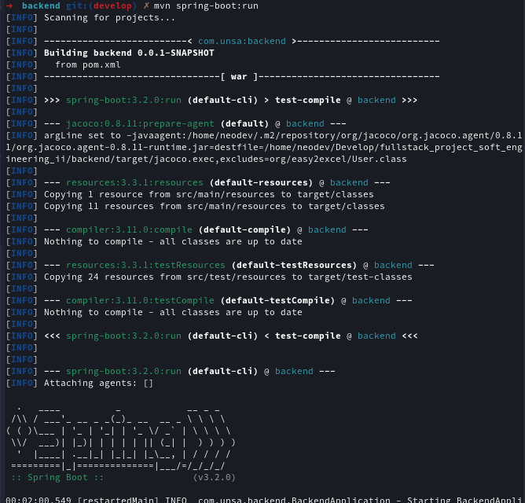
- With Gradle:
  ```bash
  gradle bootRun
  ```
  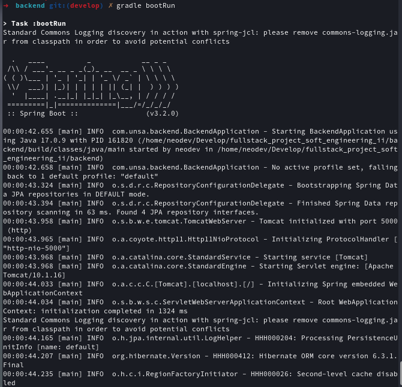

### Inicializar Frontend

Inside the directory **client**:

- For the first time, install dependencies:
  ```bash
  npm install
  ```
- Start with npm:

  ```bash
  npm start
  ```

### Inicializar Socket

Inside the directory **socket**:

- For the first time, install dependencies:
  ```bash
  npm install
  ```
- Start with npm:
  ```bash
  npm start
  ```

In the browser enter the following url: <https://localhost:3000>

## Arquitectura del Proyecto

La estructura del proyecto se rige bajo el esquema MVC (Modelo-Vista-Controlador), fundamentalmente aplicado en el backend desarrollado con Java Spring Boot 3.2. Esta sección del proyecto establece conexiones con una base de datos MySQL utilizando el patrón ORM (Object-Relational Mapping) para gestionar los datos de manera eficiente.

### Estructura del Backend

- **auth**: Archivos para autenticación (controladores, servicios, solicitudes de autenticación y registro).
- **chat**: Componentes para manejar conversaciones (controladores, servicios, modelos de chat).
- **config**: Archivos de configuración, middleware, y controladores para gestión de archivos.
- **jwt**: Implementaciones de JWT (Filtrado y servicio de JSON Web Token para autenticación).
- **messages**: Controladores, servicios y modelos para manejar mensajes y chats de usuarios.
- **posts**: Manejo de publicaciones (controladores, servicios y modelos).
- **services**: Servicios específicos como el de cronología (timeline service).
- **users**: Manejo de usuarios y roles (controladores y servicios relacionados).

En el **frontend**, se optó por utilizar **React** para desarrollar los componentes visuales. Este framework se emplea junto con JSX, CSS y JavaScript, posibilitando una interacción dinámica y eficiente con el backend, mejorando significativamente la experiencia del usuario.

Adicionalmente, se integró **NodeJS** para implementar un **socket** específico, cuya función principal es monitorear las conexiones de usuarios y transmitir señales de estado de conexión, asegurando una gestión fluida y en tiempo real de los eventos de conexión.

Esta estructura modular en el backend, junto con la creación de componentes en el frontend, permiten una organización clara y eficiente del proyecto, facilitando el desarrollo, mantenimiento y escalabilidad del mismo.

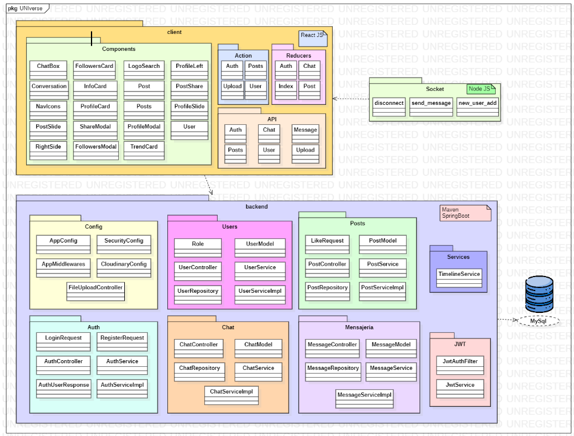

## Herramientas y Tecnologías Utilizadas

### Backend

- **Maven y Gradle:** Herramientas de gestión de dependencias y construcción de proyectos.
- **Spring Boot:** Framework para el desarrollo de aplicaciones basadas en Spring en Java.
- **JPA - Hibernate:** Mapeo Objeto-Relacional para persistencia de datos en la base de datos.
- **Spring Security:** Marco de seguridad para la autenticación y autorización en aplicaciones.

### Frontend

- **React:** Biblioteca de JavaScript para la creación de interfaces de usuario.
- **Tailwind CSS:** Framework de estilos utilizable mediante clases predefinidas.

### Testing

- **Unit Testing:** JUnit y Mockito para pruebas unitarias en el backend. Cypress para pruebas en el frontend.
- **Functional Testing:** Selenium y WebDriver para pruebas funcionales. Thunder Client para pruebas API.
- **Performance Testing:** JMeter para evaluar el rendimiento y comportamiento de la aplicación.
- **Security Testing:** Zaproxy para identificar y corregir posibles vulnerabilidades de seguridad.

### Contenedorización

- **Docker:** Plataforma para contener aplicaciones en entornos aislados y portables llamados contenedores.

## Pipeline de CI/CD en Jenkins

### Etapas y Tareas

1. **Construcción Automática**

   - Esta etapa es responsable de la compilación y empaquetado del proyecto. Utiliza herramientas como Maven o Gradle para construir la aplicación. Se pueden realizar diferentes tareas, como ejecutar pruebas unitarias o saltarlas según sea necesario.

2. **Análisis Estático con SonarQube**

   - Luego de la construcción, se realiza un análisis estático del código fuente con SonarQube para evaluar la calidad del código, identificar posibles problemas de seguridad, errores comunes y mantener un seguimiento del cumplimiento de los estándares de codificación.

3. **Pruebas Unitarias**

   - En esta etapa, se ejecutan pruebas unitarias para garantizar que las diferentes partes del código funcionen como se espera. Se utilizan herramientas como JUnit y Mockito para verificar el comportamiento de unidades individuales del código.

4. **Pruebas Funcionales con Selenium**

   - Aquí se realizan pruebas funcionales mediante Selenium. Esta herramienta permite simular la interacción del usuario con la aplicación web, verificando si las funciones clave del sistema funcionan correctamente desde una perspectiva de usuario final.

5. **Pruebas de Performance con JMeter**

   - La etapa de pruebas de rendimiento se encarga de verificar la capacidad de la aplicación bajo carga. Se utiliza JMeter para simular cargas de usuarios y evaluar el rendimiento, la escalabilidad y la estabilidad de la aplicación.

6. **Pruebas de Seguridad con Zaproxy**

   - Se llevan a cabo pruebas de seguridad utilizando Zaproxy para identificar posibles vulnerabilidades en la aplicación. Esta etapa ayuda a asegurar que la aplicación esté protegida contra posibles amenazas y ataques.

7. **Contenedorización con Docker**

   - Finalmente, se realiza la contenedorización de la aplicación mediante Docker. Esto involucra la creación de imágenes de contenedores que incluyen la aplicación y sus dependencias, lo que facilita su despliegue en diferentes entornos.

- Ejecucion del Pipeline
  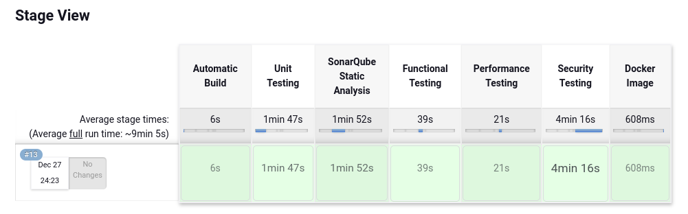

- Steps de Pipeline
  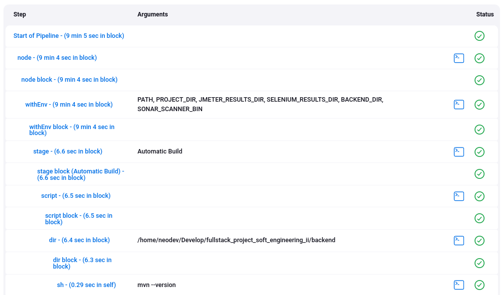

### Construcción Automática

Se llevaron a cabo procesos de construcción utilizando tanto Maven como Gradle, sin embargo, en esta ocasión nos enfocaremos en la construcción mediante Maven.

#### Dependencias y Tecnologías Utilizadas

- **Java (Versión 17)**: Lenguaje de programación principal utilizado para desarrollar la lógica del backend.
- **Spring Boot (Versión 3.2.0)**: Framework que proporciona una plataforma integral para crear aplicaciones web robustas en Java.
- **Spring Boot Starter Web**: Ofrece características para construir aplicaciones web, incluyendo RESTful services.
- **Spring Boot Starter Tomcat**: Integración con el contenedor web Tomcat.
- **Spring Boot Starter Data JPA**: Facilita el acceso y la manipulación de datos en la base de datos relacional.
- **Spring Boot Starter Security**: Proporciona capas de seguridad para la aplicación.
- **Spring Boot DevTools**: Herramientas de desarrollo para agilizar el ciclo de desarrollo.
- **Spring Security Test**: Herramientas de testing para pruebas relacionadas con la seguridad.
- **MySQL Connector J (Versión 8.2.0)**: Controlador JDBC para la conexión con bases de datos MySQL.
- **Lombok (Versión 1.18.20.0)**: Biblioteca que simplifica la escritura de código Java reduciendo la verbosidad.
- **JWT API (Versión 0.11.5)**: Permite trabajar con JSON Web Tokens para autenticación y autorización.
- **Cloudinary HTTP (Versión 1.32.2)**: Integración con el servicio de almacenamiento en la nube Cloudinary.
- **Cloudinary Taglib (Versión 1.32.2)**: Biblioteca de etiquetas para integrar Cloudinary en la interfaz web.
- **Dotenv-java (Versión 2.2.4)**: Biblioteca para cargar variables de entorno desde un archivo `.env`.
- **JUnit Jupiter Engine (Versión 5.9.1)**: Framework de testing para aplicaciones Java.
- **JUnit Jupiter API (Versión 5.9.1)**: API para escribir tests en JUnit 5.
- **JUnit Jupiter Params (Versión 5.9.1)**: Soporte para ejecución de pruebas parametrizadas en JUnit 5.
- **Mockito Core (Versión 5.8.0)**: Framework de pruebas para crear mocks en Java.
- **Jacoco Maven Plugin (Versión 0.8.11)**: Plugin para la generación de informes de cobertura de código.
- **Sonar Maven Plugin (Versión 3.10.0.2594)**: Plugin para la integración con SonarQube, una herramienta de análisis estático de código.

#### Ejecución de Construcción con Maven

Para compilar y empaquetar el proyecto utilizando Maven, ejecuta el siguiente comando en el directorio raíz del proyecto:

```bash
mvn clean install
```

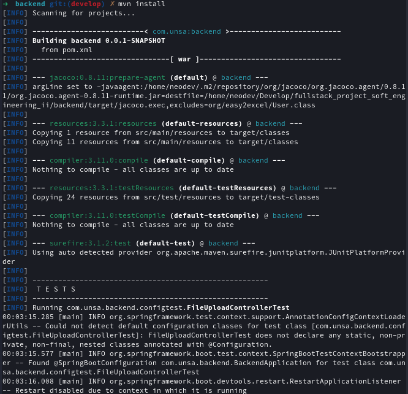

#### Ejecución de Construcción con Gradle

Para compilar y empaquetar el proyecto utilizando Gradle, ejecuta el siguiente comando en el directorio raíz del proyecto:

```bash
gradle build
```

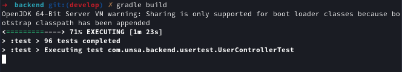

### Análisis Estático

El análisis estático del código se llevó a cabo utilizando SonarCloud, una poderosa herramienta que detecta y corrige los posibles problemas de calidad en el código fuente. Esta plataforma permitió identificar y eliminar los "code smells" y errores ("bugs"), brindando así un código más limpio, estructurado y libre de posibles vulnerabilidades.

Después de aplicar las correcciones necesarias y las mejoras recomendadas por SonarCloud, el proyecto ahora presenta 0 code smells y 0 bugs. Esto demuestra la eficacia de las correcciones realizadas y garantiza un código más robusto y confiable.

Además, se ha logrado un alto nivel de cobertura de código, con un porcentaje superior al 80%. Esta cobertura garantiza que gran parte del código esté siendo sometido a pruebas, lo que aumenta la confianza en la estabilidad y la calidad del software desarrollado.

El uso de SonarCloud ha sido fundamental para mantener altos estándares de calidad en el código, asegurando un código base sólido, seguro y altamente confiable para el proyecto.

#### Ejecución de Análisis Estático con SonarCloud

Para ejecutar solo el análisis estático, utiliza el siguiente comando en el directorio raíz del proyecto **(modificar propiedades de sonar para ingresar las credenciales y token del proyecto)**:

```bash
sonnar-scanner
```

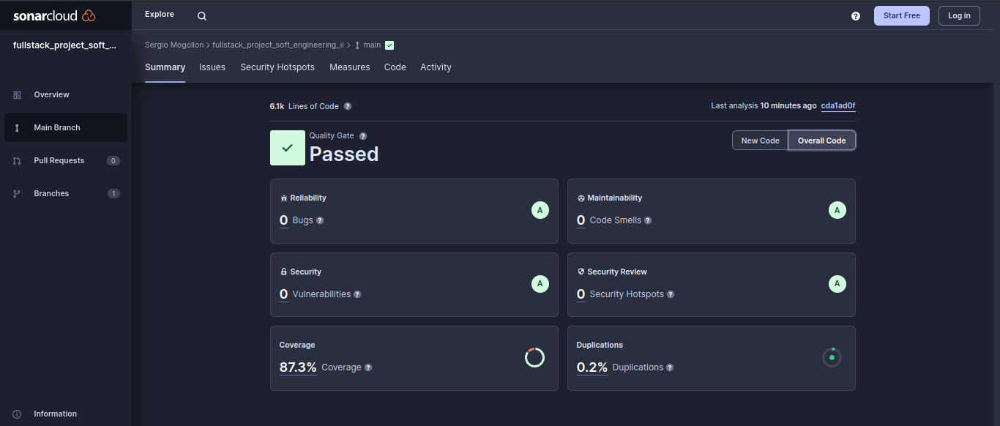

### Pruebas Unitarias

Las pruebas unitarias se llevaron a cabo utilizando JUnit y Mockito, aplicando diversas técnicas para cubrir una amplia gama de casos posibles en el código. A continuación, se presentan extractos de los casos de prueba realizados para el controlador, modelo y servicio. Estos casos de prueba fueron diseñados considerando técnicas como:

- **Pruebas de cobertura de código**: Se abarcaron múltiples rutas de ejecución dentro del código, incluyendo casos de éxito, escenarios de error y excepciones, para asegurar que cada porción de código se ejecute y se evalúe correctamente.

- **Mocking y Stubbing**: Se utilizó Mockito para crear mocks y stubs de dependencias externas, permitiendo simular el comportamiento de objetos y métodos durante las pruebas y enfocarse en la lógica específica de la unidad bajo prueba.

- **Pruebas de estado y comportamiento**: Se verificaron tanto el estado como el comportamiento del código. Las pruebas de estado aseguran que el estado interno de los objetos se modifique correctamente, mientras que las pruebas de comportamiento validan que los métodos se llamen con los parámetros esperados y la frecuencia adecuada.

En los siguientes segmentos de pruebas se muestran cómo se aplicaron estas técnicas para garantizar una cobertura exhaustiva y rigurosa de los diferentes componentes del código, asegurando su funcionamiento correcto en una variedad de situaciones y escenarios.

#### Controlador - ChatController Tests

```java
@SpringBootTest
@AutoConfigureMockMvc
@DisplayName("ChatController Tests")
@ExtendWith(MockitoExtension.class)
class ChatControllerTest {

    private MockMvc mockMvc;

    @MockBean
    private ChatService chatService;

    @Test
    @DisplayName("Create Chat - Successful")
    void testCreateChatSuccessful() throws Exception {
         ChatModel chatModel = new ChatModel();
        chatModel.setId(1L);
        chatModel.setMembers(Arrays.asList(1L, 2L));
        when(chatService.createChat(any())).thenReturn(chatModel);
        mockMvc.perform(post("/chat")
                .contentType(MediaType.APPLICATION_JSON)
                .content(new ObjectMapper().writeValueAsString(chatModel)))
                .andExpect(status().isOk());
    }
}
```

#### Modelo - ChatModel Test

```java
@SpringBootTest
@DisplayName("ChatModel Tests")
@ExtendWith(MockitoExtension.class)
class ChatModelTest {

    @MockBean
    private DateTimeProvider dateTimeProviderMock;

    @Test
    @DisplayName("onCreate - Sets Creation and Update Dates")
    void testOnCreate() {
        ChatModel chatModel = new ChatModel();
        chatModel.onCreate();
        assertNotNull(chatModel.getCreatedAt());
        assertNotNull(chatModel.getUpdatedAt());
        assertEquals(chatModel.getCreatedAt(), chatModel.getUpdatedAt());
    }
}
```

#### Servicio - ChatService Tests

```java
@SpringBootTest
@DisplayName("ChatService Tests")
@ExtendWith(MockitoExtension.class)
class ChatServiceTest {

    @MockBean
    private ChatRepository chatRepository;

    private ChatService chatService;

    @Autowired
    public ChatServiceTest(ChatService chatService) {
        this.chatService = chatService;
    }

    @DisplayName("Test obtenerChats")
    @Test
    void testObtenerChats() {
        when(chatRepository.findAll()).thenReturn(new ArrayList<>());
        List<ChatModel> result = chatService.obtenerChats();
        assertNotNull(result);
        assertTrue(result.isEmpty());
        verify(chatRepository, times(1)).findAll();
    }
}
```

#### Ejecución de Pruebas Unitarias con Maven

Para ejecutar solo las pruebas con Maven, utiliza el siguiente comando en el directorio raíz del proyecto:

```bash
mvn test
```

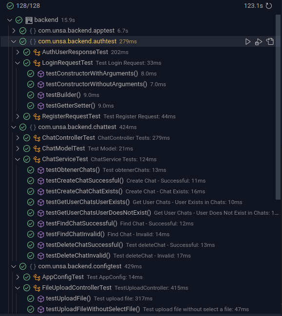

### Pruebas Funcionales

Se realizaron pruebas funcionales utilizando Selenium para evaluar la funcionalidad de las vistas y características de la aplicación. Estos casos de prueba se implementaron para probar diversas funcionalidades de la aplicación, simulando acciones de usuario y verificando los resultados obtenidos. Se aplicó la técnica de caja negra, enfocada en la interacción con la interfaz de usuario sin conocimiento interno de la implementación de la aplicación.

A continuación, se presentan un ejemplo de caso de prueba, donde se simula el registro exitoso de un usuario en la aplicación. Se interactúa con los campos del formulario de registro, se ingresan los datos necesarios y se valida que, después del registro, el nombre del usuario coincida con el resultado esperado:

- **Caso de Prueba: Registro Exitoso**

```python
class TestRegister(unittest.TestCase):

    @classmethod
    def setUpClass(cls):
        cls.driver = webdriver.Chrome()

    @classmethod
    def tearDownClass(cls):
        cls.driver.quit()

    def setUp(self):
        # Configuración previa
        # Navegar a la página de registro
        self.driver.get("http://localhost:3000/")
        self.xpath_btn_register = """//*[@id="root"]/div/div[3]/div[2]/form/div[3]/button[2]"""
        # ... Otras variables de XPath

    def tearDown(self):
        time.sleep(1)

    def test_register_success(self):
        # Acciones del usuario
        # Completar formulario de registro
        self.driver.find_element(By.XPATH, self.xpath_first_name).send_keys(FIRST_NAME)
        # ... Más acciones

        # Validación del resultado
        result = self.driver.find_element(By.XPATH, self.xpath_home_name).text
        self.quit_session()
        self.assertEqual(result, FIRST_NAME + " " + LAST_NAME)
```

#### Ejecución de Pruebas Funcionales con Selenium

Para ejecutar solo las pruebas funcionales con Selenium, utiliza el siguiente comando en el directorio raíz del proyecto:

```bash
python Runner.py /ruta/fullstack_project_soft_engineering_ii/reports
```

- Ejecución de Pruebas Funcionales:

  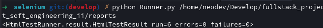

- Reporte de Pruebas Funcionales:

  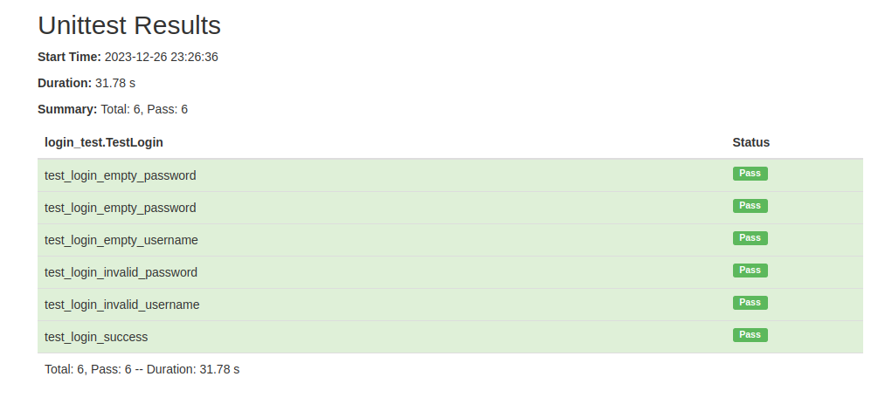

### Pruebas de Performance

Se llevaron a cabo pruebas exhaustivas de sobrecarga y rendimiento utilizando Apache JMeter. Para cada funcionalidad clave de la aplicación, se crearon archivos de prueba JMX para evaluar el rendimiento de solicitudes, incluyendo pruebas para las funcionalidades de `chat`, `inicio de sesión`, `publicaciones` y `registro`. Estas pruebas se diseñaron para simular cargas de trabajo reales y analizar el comportamiento y la capacidad del sistema bajo diferentes condiciones de carga.

Se empleó la interfaz gráfica de usuario de JMeter para crear y configurar los escenarios de prueba, y se exportaron los archivos JMX correspondientes para cada caso de prueba. Esto permitió ejecutar las pruebas de manera automatizada sin necesidad de abrir la interfaz gráfica de usuario de JMeter.

#### Ejecución de Pruebas de Performance

Para ejecutar solo las pruebas de performance, utiliza el siguiente comando en el directorio raíz del proyecto:

```bash
pendiente
```

- Ejecución de Prueba de Performance:

  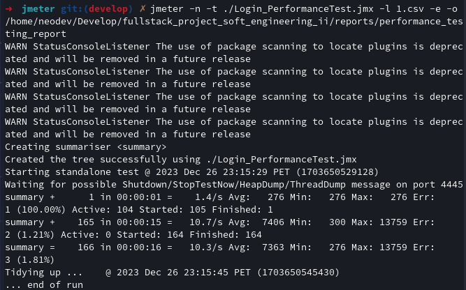

- Reporte de Prueba de Performance:

  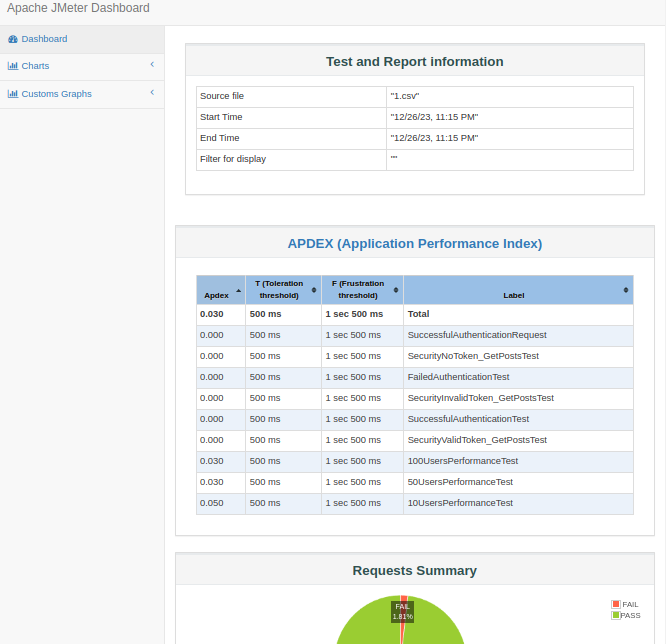

### Pruebas de Seguridad

Para garantizar la seguridad de la aplicación, se implementaron pruebas de seguridad utilizando herramientas como OWASP Dependency Check y OWASP ZAP Proxy.

- **OWASP Dependency Check**
  Se utilizó para realizar verificaciones de seguridad en los conjuntos de dependencias del backend y el cliente. Esta herramienta identifica vulnerabilidades conocidas en las bibliotecas y dependencias utilizadas en el proyecto, proporcionando información detallada sobre posibles riesgos de seguridad.

- **OWASP ZAP Proxy**
  Se empleó para ejecutar pruebas de seguridad específicamente en el cliente de la aplicación. Esta herramienta permite realizar pruebas automatizadas y exploratorias de seguridad en las aplicaciones web. Se ejecutaron pruebas exhaustivas para identificar posibles vulnerabilidades y amenazas en el cliente, proporcionando informes detallados de los hallazgos de seguridad.

#### Ejecución de Pruebas de Seguridad

Para ejecutar solo las pruebas de seguridad, utiliza el siguiente comando en el directorio raíz del proyecto:

```bash
sh "zap.sh -port 7000 -quickurl http://localhost:3000/ -quickout ${PROJECT_DIR}/reports/security_testing_report.html -quickprogress"

sh "zap.sh -daemon -port 7000 -quickurl http://localhost:3000/ -quickout ${PROJECT_DIR}/reports/security_testing_report.html -quickprogress"

sh "dependency-check.sh --scan ./backend --format HTML --out ./reports/security_testingdependency_check_report.html --disableAssembly"

sh "dependency-check.sh --scan ./client --format HTML --out ./reports/security_testingdependency_check_frontend_report.html --disableAssembly --disableYarnAudit --exclude 'node_modules/**'"
```

- Ejecución de Dependency-Check

  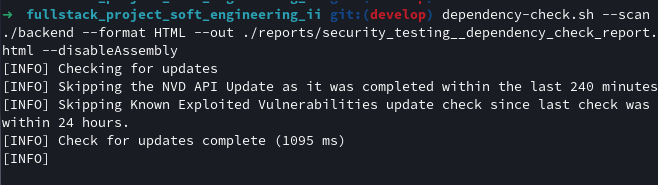

  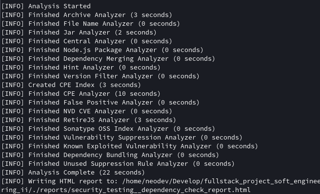

- Reporte Generado por Dependency-Check

  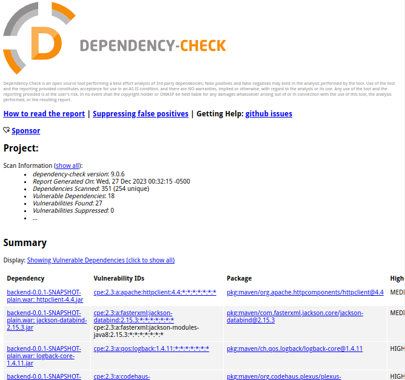

- Ejecución de ZAP Proxy

  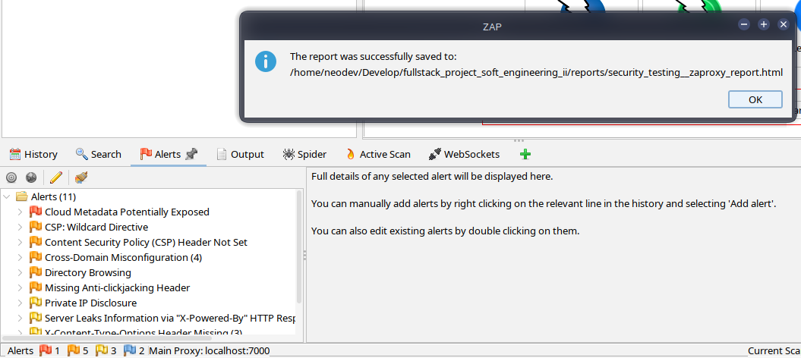

- Reporte Generado por ZAP Proxy

  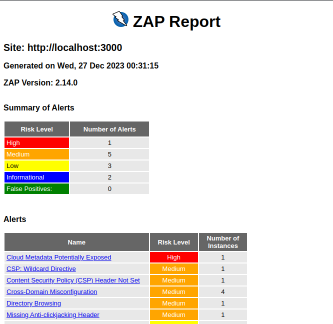

### Despliegue Automático con Docker

Para facilitar el despliegue automático, se utilizó Docker para la creación de imágenes contenedorizadas tanto para el backend como para el frontend. Docker permite crear entornos estandarizados y portátiles, garantizando que las aplicaciones se ejecuten de manera consistente en diferentes entornos.

#### Dockerfile del Backend:

```dockerfile
FROM openjdk:17-jdk-alpine

WORKDIR /app

COPY target/backend-0.0.1-SNAPSHOT.war .

EXPOSE 5000

CMD ["java", "-jar", "backend-0.0.1-SNAPSHOT.war"]

```

El Dockerfile del backend se basa en la imagen `openjdk:17-jdk-alpine`. Dentro del contenedor, se define el directorio de trabajo como `/app` y se copia el archivo JAR generado por Maven (`backend-0.0.1-SNAPSHOT.war`) al directorio de trabajo. Se expone el puerto 5000 y se configura el comando `java -jar` para ejecutar la aplicación al iniciar el contenedor.

#### Dockerfile del Frontend:

```dockerfile
FROM node:18.19.0-slim

WORKDIR /app

COPY package*.json ./

RUN npm install -g serve

COPY . .

EXPOSE 3000

CMD ["serve", "-s", "build"]

```

El Dockerfile del frontend se basa en la imagen `node:18.19.0-slim`. Define el directorio de trabajo como `/app`, copia los archivos de configuración (`package.json`) y ejecuta `npm install` para instalar las dependencias necesarias. Posteriormente, se copian todos los archivos al directorio de trabajo. Se expone el puerto 3000 y se configura el comando `serve -s build` para servir la aplicación estática.

#### Archivo docker-compose.yml:

```yaml
version: "3"

services:
  backend:
    build:
      context: ./backend
    ports:
      - "5000:5000"

  frontend:
    build:
      context: ./client
    ports:
      - "3000:3000"
    depends_on:
      - backend
```

El archivo `docker-compose.yml` se encarga de orquestar y levantar los servicios de backend y frontend. Define dos servicios (`backend` y `frontend`) basados en los Dockerfiles correspondientes. Especifica los puertos a mapear y la dependencia del frontend respecto al backend.

#### Ejecución de Pruebas de Seguridad

Este enfoque permite levantar todo el stack de la aplicación con un solo comando (`docker-compose up`) y garantiza la consistencia y portabilidad del entorno de desarrollo y producción. Para ejecutar utiliza el siguiente comando en el directorio raíz del proyecto:

```bash
docker compose up --build
```


### Gestión de Issues con Trello

Para gestionar los requisitos funcionales, no funcionales, issues, refactorizaciones y tareas, se empleó Trello como herramienta de gestión de proyectos. La organización en Trello se dividió en las siguientes categorías:

- **FRONTEND BACKLOG**
- **BACKEND BACKLOG**
- **IN PROGRESS**
- **CONCLUDED PERFORMANCE**
- **CONCLUDED PERFORMANCE**
- **CONCLUDED REFACTORIZATION**
- **CONCLUDED UNIT TEST**
- **CONCLUDED FUNCTIONAL**

La utilización de Trello permitió organizar las tareas y los estados de cada elemento de manera visual y ágil, proporcionando una visión clara del progreso del proyecto y las áreas de trabajo.

Para acceder al tablero de Trello del proyecto, [haz clic aquí Trello Social Media App](https://trello.com/b/ZDuM4Xj7/social-media-app).

## Proceso de Desarrollo y Colaboración

- **Metodología de Desarrollo:** Se empleó la metodología ágil Scrum para la gestión y planificación del proyecto. Se realizaron iteraciones cortas y regulares (sprints) para enfocarse en entregas incrementales y ajustes basados en retroalimentación continua.

- **Herramientas de Colaboración:** Para la gestión del proyecto, se utilizó la plataforma Trello para organizar tareas, gestionar sprints y realizar un seguimiento visual del progreso. Además, Git se empleó como sistema de control de versiones para el desarrollo colaborativo del código.

### Miembros del Equipo

- Sergio Daniel Mogollon Caceres ([@i-am-sergio](sergiodev))
- Braulio Nayap Maldonado Casilla ([@ShinjiMC](shinji2))
- Paul Antony Parizaca Mozo ([@PaulParizacaMozo](paul))
- Nelzon Jorge Apaza Apaza ([@nelzonapa](ramaNelzon))
- Luciana Julissa Huaman Coaquira ([@Lu0811](luci))
- Sebastian Zamalloa ([@SebastianZamalloa](agenor))

### Otras ramas

- `docker`: Contiene archivos y configuraciones relacionadas únicamente con Docker.
- `develop`: Rama de desarrollo.
- `main`: Rama principal que se utiliza en producción.

## Conclusiones

- Todos los procesos del pipeline de CI/CD se implementaron con éxito en Jenkins, en línea con la metodología Scrum. Esta implementación ha asegurado una organización efectiva y el despliegue fluido de los servicios de la aplicación.

- La estructura actual del proyecto, junto con el uso de una base de datos ORM como MySql, proporciona la capacidad de escalar de manera efectiva, permitiendo la expansión y el crecimiento progresivo de la aplicación. Se considera la posibilidad de futuras implementaciones utilizando microservicios para mejorar aún más la escalabilidad y la eficiencia del sistema.

## Referencias y Recursos Adicionales

A continuación, se presentan enlaces a la documentación oficial de las tecnologías utilizadas en este proyecto:

- [Jenkins](https://www.jenkins.io/doc/)
- [SonarQube](https://docs.sonarqube.org/latest/)
- [Spring Boot](https://spring.io/projects/spring-boot)
- [JUnit](https://junit.org/junit5/docs/current/user-guide/)
- [Apache Maven](https://maven.apache.org/guides/index.html)
- [Selenium (Python)](https://www.selenium.dev/documentation/en/)
- [Docker](https://docs.docker.com/)
- [Apache JMeter](https://jmeter.apache.org/usermanual/index.html)
- [OWASP ZAP](https://www.zaproxy.org/docs/)
- [Mockito](https://site.mockito.org/)
- [React](https://reactjs.org/docs/getting-started.html)

### Licencia

Este proyecto está licenciado bajo [Creative Commons Atribución-NoComercial-CompartirIgual 4.0 Internacional](https://creativecommons.org/licenses/by-nc-sa/4.0/).

<a rel="license" href="http://creativecommons.org/licenses/by-nc-sa/4.0/">
  
</a>
