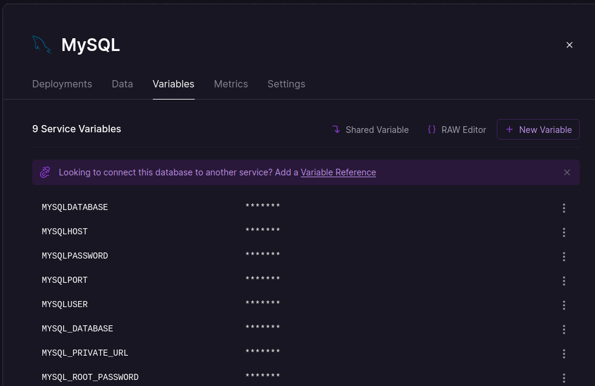

# Social Network: project_soft_engineering_ii

## Backend
    - Spring boot (Java)

## Frontend
    - Reactjs + Vitejs (Javascript)

## Unit Testing
    - JUnit
    - Cypess

## Functional Testing
    - Selenium
    - WebDriver

## Download Project

```bash
git clone https://github.com/i-am-sergio/fullstack_project_soft_engineering_ii.git
```
* Cambia el nombre_de_tu_rama por tu nombre
```bash
git branch nombre_de_tu_rama
```
```bash
git checkout nombre_de_tu_rama
```

* Para preparar tus cambios a subir
```bash
git add .
```

* Para describir tus cambios:
```bash
git commit -m "descripcion de tus cambios"
```

* Para subir tus cambios a github:
```bash
git push origin nombre_de_tu_rama
```

## Web App Execution

### Backend

First we will update the database credentials. Create a database in MySql at
<https://railway.app/> and with the information it gives us we will change
the following file:


Open the file **/backend/src/main/resources/application.properties**
and replace the following data

```
spring.datasource.url = jdbc:mysql://MYSQLHOST:MYSQLPORT/MYSQLDATABASE
spring.datasource.username = root
spring.datasource.password = MYSQLPASSWORD
spring.jpa.hibernate.ddl-auto = update

spring.servlet.multipart.max-file-size=30MB
spring.servlet.multipart.max-request-size=30MB
file.upload-dir=src/main/resources/uploads
server.port=5000
```
Inside the directory 'backend':
```bash
mvn spring-boot:run
```

Inside the directory 'client':
```bash
npm install
npm start
```
In the browser enter the following url: <localhost:3000>
